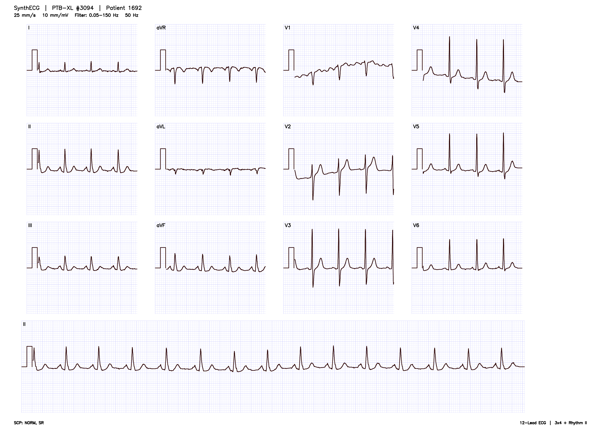
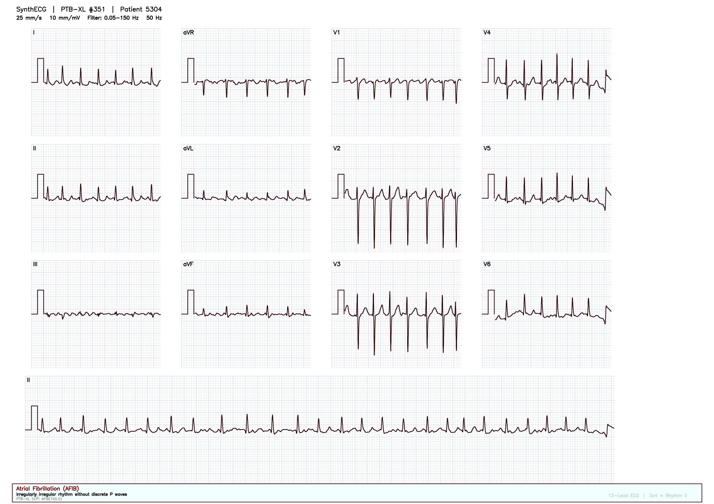
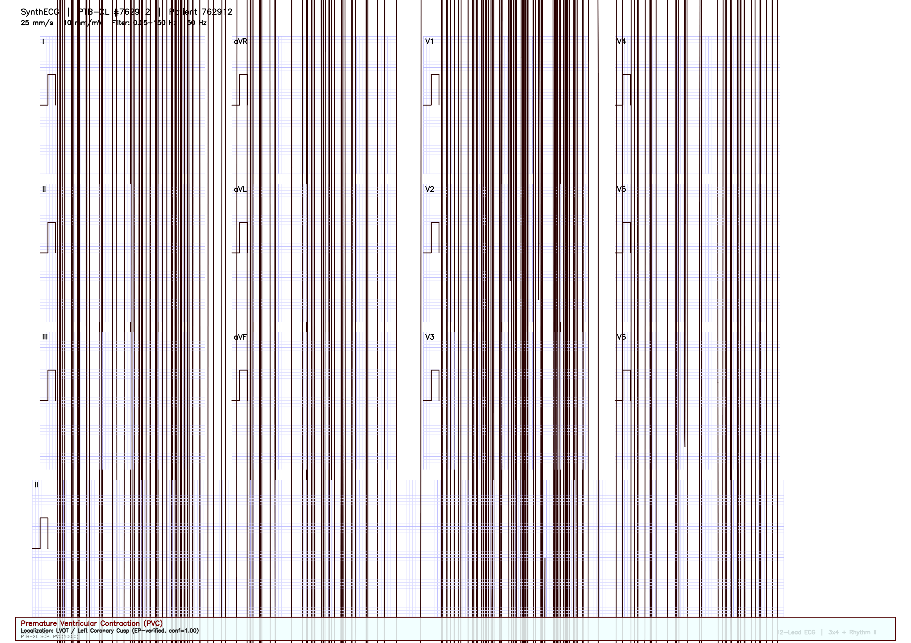
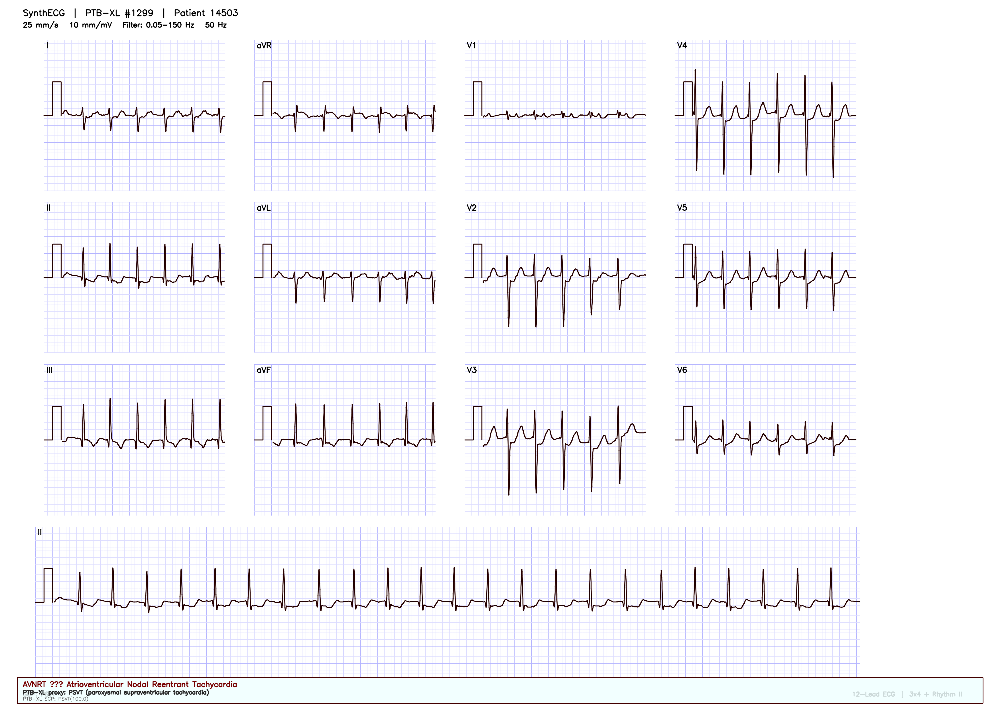
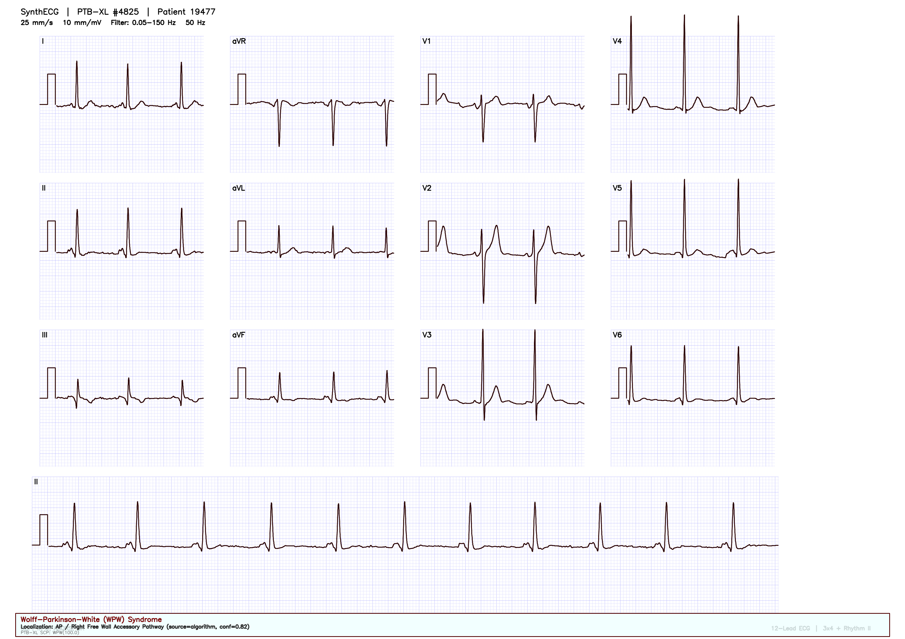

# SynthECG Generator

**SynthECG** is an open-source Python toolkit that turns real clinical ECG waveforms from the [PTB-XL database](https://physionet.org/content/ptb-xl/) into synthetic, publication-quality **12-lead ECG images** — complete with ML-ready ground truth for digitization, detection, and classification research.

> **Current version:** 0.7.0

---

## Table of contents

1. [What does this tool do?](#what-does-this-tool-do)
2. [Who is this for?](#who-is-this-for)
3. [How it works](#how-it-works)
4. [Installation](#installation)
5. [Quick start](#quick-start)
6. [Example images](#example-images)
7. [Command reference](#command-reference)
8. [Common workflows](#common-workflows)
9. [Dataset recipes](#dataset-recipes)
10. [Output format](#output-format)
11. [Annotation schema](#annotation-schema)
12. [Digitization benchmark](#digitization-benchmark)
13. [Hugging Face export](#hugging-face-export)
14. [Configuration reference](#configuration-reference)
15. [Development](#development)
16. [Troubleshooting](#troubleshooting)
17. [Citation & license](#citation--license)

---

## What does this tool do?

SynthECG fetches real 12-lead ECG signals from PTB-XL (PhysioNet), renders them onto a standard medical grid, optionally applies realistic scan/print artifacts, and exports a complete dataset folder containing:

| Artifact | Purpose |
|----------|---------|
| **PNG images** | Synthetic ECG pages for training vision models |
| **`.npy` signals** | Ground-truth waveforms (12 leads × time) |
| **JSON annotations** | Per-lead bounding boxes, render parameters, labels |
| **Segmentation masks** | Pixel-level waveform traces |
| **YOLO labels** | Lead region and lead name bounding boxes |
| **`manifest.csv`** | Dataset index for reproducibility |

Unlike using raw PTB-XL signals alone, SynthECG produces **image + label pairs** suited for ECG digitization pipelines, lead detection, and image-based arrhythmia classification — without needing private clinical scans.

---

## Who is this for?

| Audience | Typical use |
|----------|-------------|
| **ML / CV researchers** | Train digitization models (image → signal) |
| **Medical AI teams** | Build robust classifiers on synthetic ECG images |
| **Students / prototyping** | Quickly generate labeled datasets without data-sharing barriers |
| **Benchmark authors** | Evaluate round-trip digitization with known ground truth |

---

## How it works

```
PTB-XL metadata (cached locally)
        │
        ▼
  Filter by SCP code / split / seed
        │
        ▼
  Fetch waveform via PhysioNet (wfdb)
        │
        ▼
  Optional bandpass filter (0.5–40 Hz)
        │
        ▼
  Render ECG image (OpenCV, 300 DPI)
   ├── 3×4 + rhythm layout  OR  12×1 stack
   ├── Medical grid, calibration pulses
   └── Clinical header / footer
        │
        ▼
  Apply artifact profile (clean / scan / clinical)
        │
        ▼
  Export images + signals + masks + labels + manifest
```

**Data source:** All waveforms come from PTB-XL — 21,799 real clinical 12-lead recordings annotated with SCP-ECG diagnostic codes (e.g. `NORM`, `AFIB`, `PVC`, `SR`).

**First run note:** The PTB-XL metadata CSV is downloaded once (~30 s) and cached at `~/.cache/synthecg/`. Individual ECG signals are fetched from PhysioNet on demand during generation.

---

## Installation

### Requirements

- Python **3.10+**
- Internet access (PhysioNet signal fetch on first use per record)

### Basic install

```bash
git clone https://github.com/umutinevi/EA-Syntetic-ECG-Creator.git
cd EA-Syntetic-ECG-Creator
pip install -e .
```

Verify installation:

```bash
synthecg --help
synthecg-benchmark --help
```

### Optional extras

```bash
# Development (tests)
pip install -e ".[dev]"

# Hugging Face Hub upload
pip install -e ".[hf]"
```

---

## Quick start

Generate 5 normal ECG images with full ground truth:

```bash
synthecg -n 5 -t NORM --seed 42 -o my_first_dataset
```

Inspect the output:

```bash
ls my_first_dataset/
# manifest.csv  images/  signals/  annotations/  masks/  labels/
```

See [`examples/sample_12lead_ecg.png`](examples/sample_12lead_ecg.png) for a sample output image, or the full [example gallery](#example-images) below.

Run the digitization benchmark (best with clean images):

```bash
synthecg -n 3 -t NORM --seed 42 --save-clean --augment-profile clean -o bench_demo
synthecg-benchmark bench_demo
# Writes bench_demo/benchmark_report.json with per-lead correlation scores
```

---

## Example images

The images below are **synthetic 12-lead ECG renderings** produced by SynthECG from real waveform data. They are **not** original clinical scan documents. Each example lists its underlying data source, record identifier, and how any arrhythmia localization label was obtained.

Full machine-readable provenance: [`examples/arrhythmia_index.json`](examples/arrhythmia_index.json)

### Normal sinus rhythm (PTB-XL)

| | |
|---|---|
| **Diagnosis** | Normal sinus rhythm (`NORM`, `SR`) |
| **Source dataset** | PTB-XL v1.0.3, record `ecg_id=3094` |
| **Localization** | Not applicable |



### Arrhythmia gallery

#### Atrial fibrillation (AFIB)

| | |
|---|---|
| **Source dataset** | PTB-XL v1.0.3, record `ecg_id=351` |
| **SCP codes** | `AFIB` |
| **Localization** | None (AFIB has no discrete anatomic origin on surface ECG) |



#### Premature ventricular contraction — left coronary cusp (PVC / LCC)

| | |
|---|---|
| **Source dataset** | Zheng OT-VA database, `hospital_id=762912` |
| **Localization** | Left coronary cusp (LCC) — **EP ablation ground truth** |
| **Label source** | Catheter ablation–validated origin from Zheng et al. (2020) |



#### AV nodal reentrant tachycardia (AVNRT proxy)

| | |
|---|---|
| **Source dataset** | PTB-XL v1.0.3, record `ecg_id=1299` |
| **SCP codes** | `PSVT` (closest PTB-XL code; PTB-XL has no `AVNRT` label) |
| **Localization** | Mechanism proxy only (`slow_fast_avnrt`) — algorithm-inferred, not EP-confirmed |



#### Wolff–Parkinson–White — right free wall (WPW)

| | |
|---|---|
| **Source dataset** | PTB-XL v1.0.3, record `ecg_id=4825` |
| **SCP codes** | `WPW` |
| **Localization** | Right free wall accessory pathway — **algorithm-inferred** (simplified Arruda-style delta-wave analysis), not ablation-confirmed |



> **Important:** Algorithm-inferred localization labels (WPW, AVNRT proxy) are research aids only and must not be treated as electrophysiology ground truth. See [docs/LOCALIZATION.md](docs/LOCALIZATION.md).

Regenerate all examples:

```bash
python scripts/generate_arrhythmia_examples.py
```

---

## Command reference

SynthECG exposes two entry points:

| Command | Description |
|---------|-------------|
| `synthecg` | Generate datasets, build recipes, export to Hugging Face |
| `synthecg-benchmark` | Evaluate round-trip digitization quality |

### `synthecg` subcommands

```
synthecg generate [options]     # Generate ECG images (also the default)
synthecg dataset list           # List predefined recipes
synthecg dataset build          # Build a dataset from a recipe
synthecg export hf              # Prepare or push a Hugging Face dataset
```

> **Backward compatibility:** `synthecg -n 5 -t NORM` works without the `generate` subcommand.

### Generate options

| Flag | Default | Description |
|------|---------|-------------|
| `-n`, `--count` | `5` | Number of ECG images to generate |
| `-t`, `--type` | `random` | SCP pathology code (`NORM`, `AFIB`, `PVC`, `SR`, …) or `random` |
| `-o`, `--output-dir` | `output_ecgs` | Output directory |
| `--seed` | none | Random seed for reproducible sampling and augmentations |
| `--split` | `all` | PTB-XL split: `train` (folds 1–8), `val` (9), `test` (10) |
| `--layout` | `3x4+1` | Page layout: `3x4+1` or `12x1` |
| `--renderer` | `opencv` | Rendering backend: `opencv` or `matplotlib` |
| `--speed` | `25` | Paper speed in mm/s (`25` or `50`) |
| `--gain` | `10` | Voltage gain in mm/mV (`5`, `10`, or `20`) |
| `--no-grid` | off | Disable ECG grid lines |
| `--augment-profile` | `scan` | Artifact level: `clean`, `scan`, or `clinical` |
| `--bandpass` | off | Apply 0.5–40 Hz bandpass before rendering |
| `--save-clean` | off | Also save pre-augmentation images to `images/clean/` |
| `--workers` | `1` | Parallel worker processes |
| `--resume` | off | Skip records already listed in `manifest.csv` |
| `--unique-patients` | off | Sample at most one record per patient |
| `--include-codes` | none | Require all listed SCP codes (multi-label AND) |
| `--exclude-codes` | none | Exclude records containing any listed SCP code |
| `--cache-dir` | `~/.cache/synthecg` | Custom metadata cache directory |
| `--no-signals` | off | Skip `.npy` signal export |
| `--no-annotations` | off | Skip JSON annotation export |
| `--no-masks` | off | Skip segmentation mask export |
| `--no-yolo` | off | Skip YOLO label export |

### Augment profiles

| Profile | Effects applied |
|---------|-----------------|
| `clean` | No artifacts — ideal for digitization baselines |
| `scan` | Pink tint, noise, lighting gradient, blur; optionally rotation and JPEG compression |
| `clinical` | All scan effects plus perspective warp (simulates photographed/scanned pages) |

### Layouts

| Layout | Description |
|--------|-------------|
| `3x4+1` | Classic clinical format: 4 columns × 3 lead rows + Lead II rhythm strip (default) |
| `12x1` | Vertical stack: all 12 leads, each showing the full 10-second trace |

---

## Common workflows

### 1. Build a digitization training set

```bash
synthecg -n 100 -t random --split train --seed 42 \
  --save-clean --bandpass --augment-profile scan \
  -o digitization_train
```

Use `images/clean/` for training digitizers; use augmented `images/` for robustness testing.

### 2. Build a pathology-specific set

```bash
# Atrial fibrillation, validation split only
synthecg -n 50 -t AFIB --split val --seed 42 -o afib_val

# Normal sinus rhythm, no AFIB contamination
synthecg -n 50 -t random --exclude-codes AFIB --seed 42 -o norm_no_afib
```

### 3. Use the 12×1 stacked layout

```bash
synthecg -n 20 -t NORM --layout 12x1 --save-clean --seed 42 -o stack_12x1
```

### 4. Large batch with parallel workers

```bash
synthecg -n 200 -t random --split train --workers 4 --seed 42 -o big_batch
```

### 5. Resume an interrupted run

If generation stops midway, re-run with `--resume` to skip records already in the manifest:

```bash
synthecg -n 100 -t NORM --seed 42 -o big_batch --resume
```

### 6. Legacy script entry point

The original script still works and delegates to the package CLI:

```bash
python generate_realistic_ecg.py -n 5 -t NORM -o output_ecgs
```

---

## Dataset recipes

Recipes are predefined configurations for common research scenarios. List them with:

```bash
synthecg dataset list
```

Build a recipe:

```bash
synthecg dataset build --recipe <name> -o <output_dir> --seed 42
```

| Recipe | Samples | Description |
|--------|---------|-------------|
| `digitization-v1` | 100 | Random train split, scan artifacts, full GT, bandpass |
| `arrhythmia-cls` | 100 (25×4) | Balanced AFIB / SR / PVC / NORM for classification |
| `clinical-scan` | 50 | Clinical artifact profile with perspective warps |
| `clean-baseline` | 20 | No artifacts — for digitization benchmark baselines |
| `digitization-12x1` | 50 | 12×1 stacked layout for vertical lead digitization |
| `arrhythmia-localization-v1` | 20 (5×4) | EP-validated OT-VA sites from Zheng dataset (LCC, FreeWall, septal) |

Example:

```bash
synthecg dataset build --recipe arrhythmia-cls -o arrhythmia_train --seed 42 --workers 4
```

Override worker count or resume:

```bash
synthecg dataset build --recipe digitization-v1 -o dig_v1 --workers 8 --resume
```

---

## Output format

After generation, your output directory looks like this:

```
my_dataset/
├── manifest.csv              # Index of all samples
├── benchmark_report.json     # (after running synthecg-benchmark)
├── images/
│   ├── ecg_NORM_12345.png          # Final augmented image
│   └── clean/
│       └── ecg_NORM_12345.png      # Pre-augmentation (if --save-clean)
├── signals/
│   └── ecg_NORM_12345.npy          # float32 array, shape (12, n_samples), units: mV
├── masks/
│   └── ecg_NORM_12345.png          # Binary waveform segmentation mask
├── labels/
│   ├── classes.txt                 # YOLO class names: lead_region, lead_label
│   └── ecg_NORM_12345.txt          # YOLO-format bounding boxes
└── annotations/
    └── ecg_NORM_12345.json         # Full metadata + per-lead geometry
```

### `manifest.csv` columns

| Column | Description |
|--------|-------------|
| `sample_id` | Unique sample identifier (e.g. `ecg_NORM_12345`) |
| `ecg_id` | PTB-XL record ID |
| `patient_id` | PTB-XL patient ID |
| `diagnosis_query` | SCP code used for filtering |
| `scp_codes` | Full SCP label dictionary (JSON) |
| `strat_fold` | PTB-XL stratified fold (1–10) |
| `image_path` | Relative path to final PNG |
| `signal_path` | Relative path to `.npy` signal |
| `annotation_path` | Relative path to JSON annotation |
| `mask_path` | Relative path to segmentation mask |
| `yolo_path` | Relative path to YOLO label file |
| `clean_image_path` | Relative path to clean PNG (if saved) |
| `augmentations` | List of applied artifact steps (JSON) |

### Loading a sample in Python

```python
import json
import numpy as np
from pathlib import Path

dataset = Path("my_dataset")
sample_id = "ecg_NORM_12345"

image_path = dataset / "images" / f"{sample_id}.png"
signal = np.load(dataset / "signals" / f"{sample_id}.npy")   # shape: (12, 5000)
annotation = json.loads((dataset / "annotations" / f"{sample_id}.json").read_text())

print(f"Leads: {annotation['signal']['lead_names']}")
print(f"Sampling rate: {annotation['signal']['fs']} Hz")
print(f"SCP codes: {annotation['scp_codes']}")
```

---

## Annotation schema

Each `annotations/*.json` file contains everything needed for digitization and detection. When arrhythmia localization is available, a `localization` block records the anatomical site, provenance (`ep_ablation` or `algorithm`), and confidence. See [docs/LOCALIZATION.md](docs/LOCALIZATION.md).

```json
{
  "ecg_id": 12345,
  "patient_id": 6789,
  "scp_codes": {"NORM": 80.0, "SR": 0.0},
  "strat_fold": 3,
  "render": {
    "layout": "3x4+1",
    "backend": "opencv",
    "speed_mm_s": 25,
    "gain_mm_mv": 10,
    "dpi": 300,
    "px_per_mv": 118.11,
    "px_per_second": 295.28,
    "width": 3508,
    "height": 2480
  },
  "signal": {
    "fs": 500.0,
    "n_samples": 5000,
    "lead_names": ["I","II","III","aVR","aVL","aVF","V1","V2","V3","V4","V5","V6"],
    "units": "mV"
  },
  "leads": [
    {
      "name": "I",
      "lead_idx": 0,
      "bbox": [80, 120, 738, 575],
      "plot_bbox": [154, 140, 600, 535],
      "waveform_bbox": [220, 140, 534, 535],
      "baseline_y": 407,
      "t_start": 0.0,
      "t_end": 2.5
    }
  ],
  "augment": {
    "profile": "scan",
    "applied": ["pink_tint", "gaussian_noise", "lighting_gradient", "gaussian_blur"]
  },
  "paths": {
    "image": "images/ecg_NORM_12345.png",
    "signal": "signals/ecg_NORM_12345.npy",
    "mask": "masks/ecg_NORM_12345.png",
    "yolo": "labels/ecg_NORM_12345.txt",
    "clean_image": "images/clean/ecg_NORM_12345.png"
  }
}
```

**Key fields for digitization:**

- `waveform_bbox` — pixel region containing the trace (excludes calibration pulse)
- `baseline_y` — vertical baseline in pixels for mV conversion
- `render.px_per_mv` — pixels per millivolt
- `t_start` / `t_end` — time segment covered by the lead panel

---

## Digitization benchmark

SynthECG includes a built-in round-trip benchmark that:

1. Reads generated images and annotation geometry
2. Digitizes traces via column-scan extraction
3. Compares against ground-truth `.npy` signals
4. Reports per-lead Pearson correlation

```bash
# Generate with clean images (recommended for benchmark)
synthecg -n 10 -t NORM --save-clean --augment-profile clean --seed 42 -o bench_set

# Run benchmark on clean pre-augmentation images (default)
synthecg-benchmark bench_set

# Run benchmark on final augmented images
synthecg-benchmark bench_set --use-augmented

# Limit to first N samples
synthecg-benchmark bench_set --limit 5
```

Output is written to `bench_set/benchmark_report.json`:

```json
{
  "dataset_dir": "bench_set",
  "use_clean": true,
  "n_samples": 10,
  "mean_correlation": 0.87,
  "results": [
    {
      "sample_id": "ecg_NORM_3094",
      "mean_correlation": 0.91,
      "lead_correlations": {"I_0.0-2.5": 0.93, "...": "..."}
    }
  ]
}
```

> Clean images typically achieve ~0.85–0.90 mean correlation. Augmented images score lower due to artifact distortion — use them to test robustness, not baseline accuracy.

---

## Hugging Face — automated publishing

SynthECG can **generate, export, benchmark, and publish** a dataset to the Hugging Face Hub in one command.

### Install HF extras

```bash
pip install -e ".[hf]"
export HF_TOKEN=hf_your_token_here   # needs write access
```

### One-command publish (recommended)

Generate from a recipe, export, and push:

```bash
python -m synthecg.hf publish \
  --recipe clean-baseline \
  --repo-id your-username/synthecg-demo \
  --output-dir ./datasets/demo \
  --benchmark \
  --push
```

Or use the shortcut entry point:

```bash
synthecg-hf publish --recipe digitization-v1 --repo-id your-user/synthecg-v1 --push
```

### Publish from an existing dataset

```bash
python -m synthecg.hf publish \
  -d ./my_dataset \
  --repo-id your-username/synthecg-v1 \
  --benchmark \
  --push
```

### YAML config (best for automation)

Copy and edit `configs/hf_publish.example.yaml`:

```yaml
repo_id: your-username/synthecg-digitization-v1
output_dir: ./datasets/digitization-v1
recipe: digitization-v1
seed: 42
workers: 2
split: train
push: true
private: false
benchmark: true
format: folder   # folder | datasets
```

Run:

```bash
python -m synthecg.hf publish --config configs/hf_publish.example.yaml
```

### Publish pipeline steps

| Step | Action |
|------|--------|
| 1 | Generate dataset (from `--recipe` or existing `-d`) |
| 2 | Optional digitization benchmark |
| 3 | Prepare HF export (`README.md`, `metadata.parquet`, assets) |
| 4 | Push to Hub (if `--push`) |

A report is saved to `{output_dir}/hf_publish_report.json`.

### Upload formats

| Format | Flag | What gets uploaded |
|--------|------|-------------------|
| `folder` | `--format folder` | Full dataset: images, signals, masks, labels, annotations, parquet |
| `datasets` | `--format datasets` | HF Datasets API: images + metadata columns only |

### GitHub Actions automation

A manual workflow is included at `.github/workflows/publish-hf.yml`.

1. Add `HF_TOKEN` as a repository secret (write access).
2. Go to **Actions → Publish to Hugging Face → Run workflow**.
3. Enter `recipe`, `repo_id`, and optional `count`.

### Manual export (without publish pipeline)

```bash
# Prepare local HF folder only
python -m synthecg.hf prepare -d my_dataset -o my_dataset/hf_export

# Or via export subcommand
synthecg export hf -d my_dataset -o my_dataset/hf_export --repo-id your-user/demo
synthecg export hf -d my_dataset --repo-id your-user/demo --push --private
```

### HF export folder contents

```
my_dataset/hf_export/
├── README.md            # HF dataset card (auto-generated)
├── dataset_info.json    # Summary metadata
├── metadata.parquet     # Flat index for HF Datasets
├── manifest.csv
├── images/
├── signals/
├── annotations/
├── masks/
└── labels/
```

### Load from Hugging Face

```python
from datasets import load_dataset

# After publishing (metadata + images via datasets format)
ds = load_dataset("your-username/synthecg-demo")

# Or clone the repo and load locally
# git clone https://huggingface.co/datasets/your-username/synthecg-demo
import numpy as np
signal = np.load("signals/ecg_NORM_12345.npy")
```

See also: [docs/HUGGINGFACE.md](docs/HUGGINGFACE.md) for the full automation guide.

---

## Configuration reference

### PTB-XL splits

SynthECG respects the official PTB-XL stratified folds:

| Split | Folds | Typical use |
|-------|-------|-------------|
| `train` | 1–8 | Model training |
| `val` | 9 | Hyperparameter tuning |
| `test` | 10 | Final evaluation |

Always use `--split train` when building training data to avoid leakage.

### Common SCP codes

| Code | Meaning |
|------|---------|
| `NORM` | Normal ECG |
| `SR` | Sinus rhythm |
| `AFIB` | Atrial fibrillation |
| `PVC` | Premature ventricular contraction |
| `STEMI` | ST-elevation myocardial infarction |
| `IMI` | Inferior myocardial infarction |
| `LVH` | Left ventricular hypertrophy |

Use `random` to sample from all available records (optionally filtered by split).

### Render parameters

| Parameter | Options | Clinical meaning |
|-----------|---------|------------------|
| `--speed` | 25, 50 mm/s | Paper speed (time axis scale) |
| `--gain` | 5, 10, 20 mm/mV | Voltage sensitivity |
| `--no-grid` | on/off | Grid visibility (some real scans have faint grids) |
| `--layout` | `3x4+1`, `12x1` | Page layout format |

---

## Development

### Run tests

```bash
pip install -e ".[dev]"
pytest
```

CI runs automatically on Python 3.10, 3.11, and 3.12 via GitHub Actions.

### Project structure

```
synthecg/
├── cli.py                 # Command-line interface
├── pipeline.py            # Generation orchestration
├── config.py              # Configuration dataclasses
├── data/
│   ├── ptbxl.py           # Metadata loading, filtering, sampling
│   ├── fetch.py           # PhysioNet signal fetch
│   └── preprocess.py      # Bandpass filtering
├── render/
│   ├── opencv_renderer.py # OpenCV render entry point
│   └── layouts/           # 3x4+1 and 12x1 layout implementations
├── augment/               # Scan/clinical artifact pipeline
├── export/                # Manifest, masks, YOLO, Hugging Face
├── benchmark/             # Round-trip digitization evaluation
└── recipes/               # Predefined dataset configurations
```

---

## Troubleshooting

### First run is slow

The PTB-XL metadata CSV (~30 s) is downloaded once and cached at `~/.cache/synthecg/ptbxl_database.csv`. Each ECG signal is fetched individually from PhysioNet during generation.

**Fix:** Use `--cache-dir /path/to/cache` for a custom cache location. Subsequent runs are much faster.

### `No records found for diagnosis: X`

The SCP code may not exist in the filtered split, or the code name is misspelled.

**Fix:** Check available codes in the [PTB-XL documentation](https://physionet.org/content/ptb-xl/). Use `-t random` to verify the pipeline works first.

### Resume generates fewer samples than expected

`--resume` skips already-completed `ecg_id`s. If you want 100 **new** samples, keep the same `--seed` and output directory — already-generated IDs are skipped and new ones fill the count.

### Benchmark correlation is low

- Use `--save-clean --augment-profile clean` for baseline digitization tests
- Avoid `--use-augmented` when measuring best-case accuracy
- Ensure annotations include `waveform_bbox` (requires OpenCV renderer, the default)

### Hugging Face push fails

```bash
pip install -e ".[hf]"
export HF_TOKEN=hf_...
synthecg export hf -d my_dataset --repo-id user/repo-name --push
```

The token needs **write** access to the target dataset repository.

---

## Citation & license

### SynthECG software

This repository (the SynthECG **code**) is released under the [MIT License](LICENSE).

If you use SynthECG in research, please cite this repository and the **underlying waveform datasets** listed below.

---

### Example images — data sources & attribution

The PNG files in [`examples/`](examples/) are **derivative synthetic renderings** created by SynthECG. The **underlying 12-lead waveforms** come from the datasets below. When you redistribute, publish, or build upon these examples, you must comply with each dataset’s license and citation requirements.

| Example file | Underlying waveform source | Record ID | License |
|--------------|---------------------------|-----------|---------|
| `sample_12lead_ecg.png` | PTB-XL v1.0.3 | `ecg_id=3094` | [CC BY 4.0](https://creativecommons.org/licenses/by/4.0/) |
| `afib_atrial_fibrillation.png` | PTB-XL v1.0.3 | `ecg_id=351` | [CC BY 4.0](https://creativecommons.org/licenses/by/4.0/) |
| `pvc_left_coronary_cusp.png` | Zheng OT-VA database | `hospital_id=762912` | [CC BY 4.0](https://creativecommons.org/licenses/by/4.0/) |
| `avnrt_nodal_reentrant_tachycardia.png` | PTB-XL v1.0.3 | `ecg_id=1299` | [CC BY 4.0](https://creativecommons.org/licenses/by/4.0/) |
| `wpw_right_free_wall.png` | PTB-XL v1.0.3 | `ecg_id=4825` | [CC BY 4.0](https://creativecommons.org/licenses/by/4.0/) |

**SCP-ECG diagnostic codes** used with PTB-XL follow the Standard Communications Protocol for computer-assisted ECG interpretation (SCP-ECG), as distributed with PTB-XL.

**Localization algorithms** referenced in examples and annotations:

| Algorithm | Used for | Reference |
|-----------|----------|-----------|
| `pvc_otva_v1` | PVC / OT-VA origin (RVOT vs LVOT, LCC hint) | Betensky BP et al. *J Am Coll Cardiol.* 2011;57(22):2255–2262. [doi:10.1016/j.jacc.2011.02.018](https://doi.org/10.1016/j.jacc.2011.02.018) |
| `wpw_arruda_simplified_v1` | WPW accessory pathway region | Arruda MS et al. *J Cardiovasc Electrophysiol.* 1998;9(1):2–12. [doi:10.1111/j.1540-8167.1998.tb00861.x](https://doi.org/10.1111/j.1540-8167.1998.tb00861.x) |
| `mechanism_proxy_v1` | AVNRT vs PSVT proxy label | Heuristic only — not a validated clinical classifier |

---

### PTB-XL (primary waveform source)

SynthECG fetches PTB-XL v1.0.3 from PhysioNet by default.

**PhysioNet version citation (required when using v1.0.3):**

> Wagner, P., Strodthoff, N., Bousseljot, R., Samek, W., & Schaeffter, T. (2022). PTB-XL, a large publicly available electrocardiography dataset (version 1.0.3). *PhysioNet*. https://doi.org/10.13026/kfzx-aw45

**Original publication:**

> Wagner, P., Strodthoff, N., Bousseljot, R.-D., Kreiseler, D., Lunze, F.I., Samek, W., Schaeffter, T. (2020). PTB-XL, a large publicly available electrocardiography dataset. *Scientific Data*, 7, 154. https://doi.org/10.1038/s41597-020-0495-6

**PhysioNet platform citation:**

> Goldberger, A., Amaral, L., Glass, L., Hausdorff, J., Ivanov, P. C., Mark, R., … & Stanley, H. E. (2000). PhysioBank, PhysioToolkit, and PhysioNet: Components of a new research resource for complex physiologic signals. *Circulation*, 101(23), e215–e220.

- **Dataset page:** https://physionet.org/content/ptb-xl/1.0.3/
- **License:** [Creative Commons Attribution 4.0 International (CC BY 4.0)](https://creativecommons.org/licenses/by/4.0/)

---

### Zheng OT-VA database (PVC localization ground truth)

Used for outflow-tract PVC/VT origin labels (e.g. left coronary cusp) when `--database zheng-otva` is selected or in the PVC LCC example image.

**Publication:**

> Zheng, J., Fu, G., Anderson, K., Chu, H. & Rakovski, C. A 12-Lead ECG database to identify origins of idiopathic ventricular arrhythmia containing 334 patients. *Scientific Data* **7**, 98 (2020). https://doi.org/10.1038/s41597-020-0440-8

**Data repository:**

> Zheng, J., Fu, G., Anderson, K., Chu, H. & Rakovski, C. A 12-Lead ECG Database to identify outflow tract origins of idiopathic ventricular arrhythmia containing more than 300 patients. *figshare* (2019). https://doi.org/10.6084/m9.figshare.c.4668086.v2

- **License:** [Creative Commons Attribution 4.0 International (CC BY 4.0)](https://creativecommons.org/licenses/by/4.0/)
- **Institutions:** Chapman University & Ningbo First Hospital of Zhejiang University

---

### Third-party software libraries

SynthECG depends on open-source libraries including NumPy, SciPy, pandas, OpenCV, Matplotlib, and wfdb (PhysioNet/WFDB Python tools). See [`pyproject.toml`](pyproject.toml) for the full dependency list.

---

### Disclaimer

SynthECG is a **research and educational tool**. Generated images and localization labels are not intended for clinical diagnosis, treatment, or regulatory submission. Always verify dataset licenses and citation requirements before redistributing derived images or publishing results. Algorithm-inferred localization must be clearly distinguished from electrophysiology ground truth.

---

## Summary cheat sheet

```bash
# Install
pip install -e .

# Quick generate
synthecg -n 10 -t NORM --seed 42 -o my_dataset

# Recipe build
synthecg dataset build --recipe digitization-v1 -o dig_train --seed 42

# 12x1 layout
synthecg -n 20 --layout 12x1 --save-clean -o stack_data

# Resume interrupted job
synthecg -n 100 -t random --seed 42 -o big_job --resume

# Benchmark
synthecg-benchmark my_dataset

# Hugging Face export
synthecg export hf -d my_dataset -o my_dataset/hf_export
```
